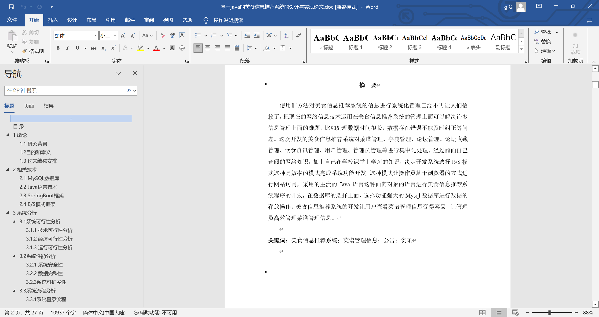
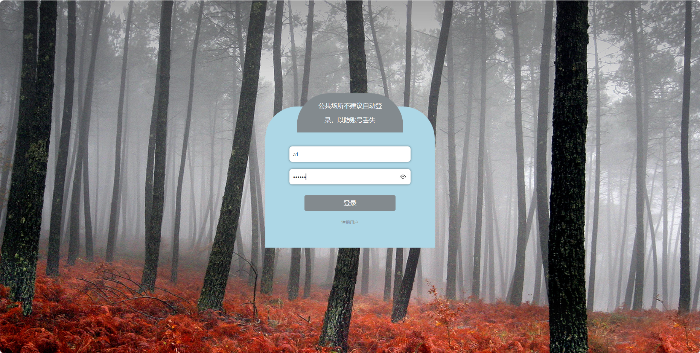
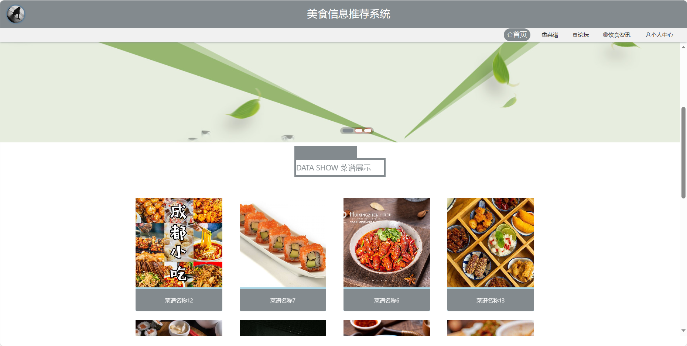
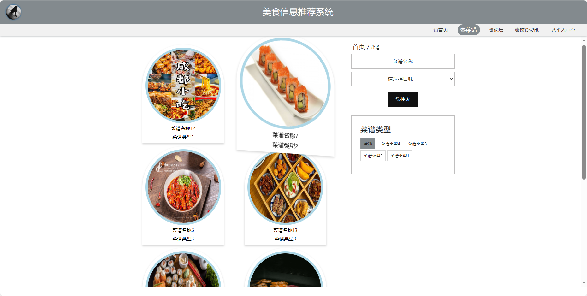
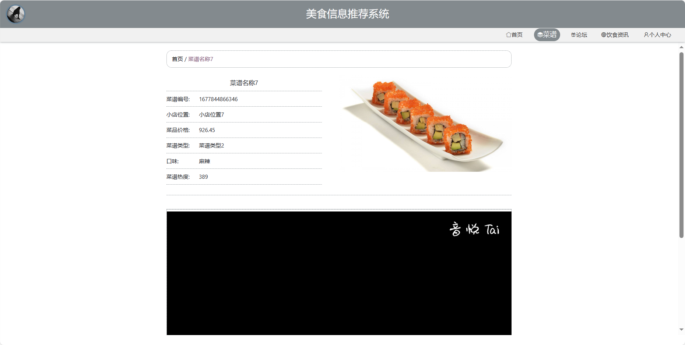
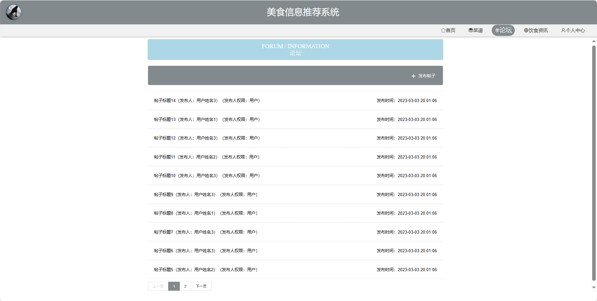
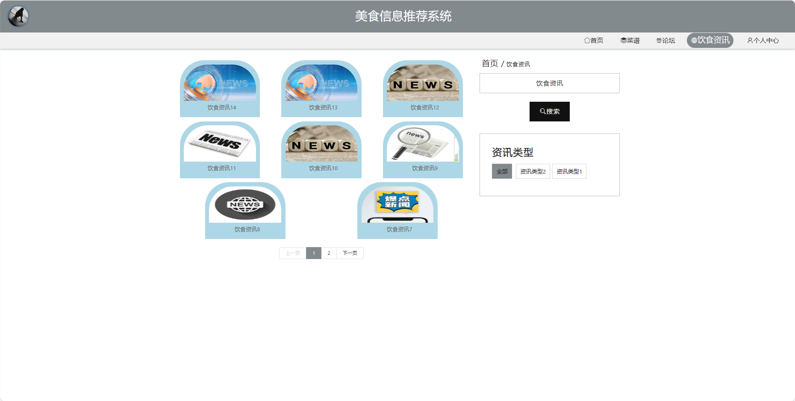
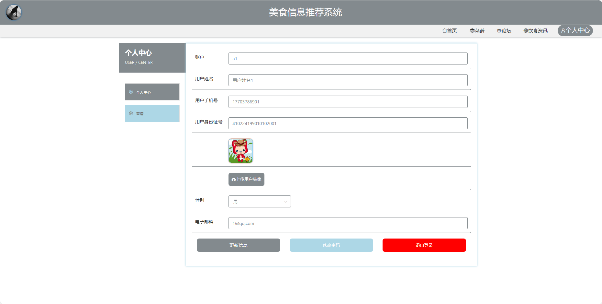
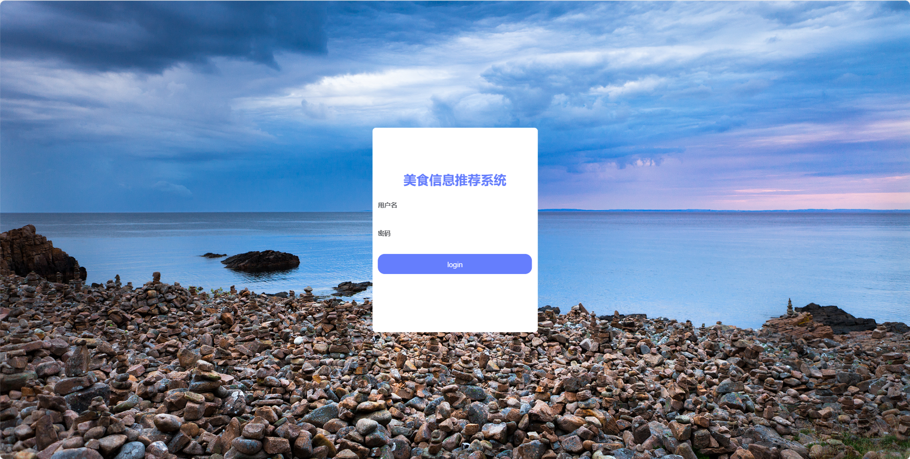
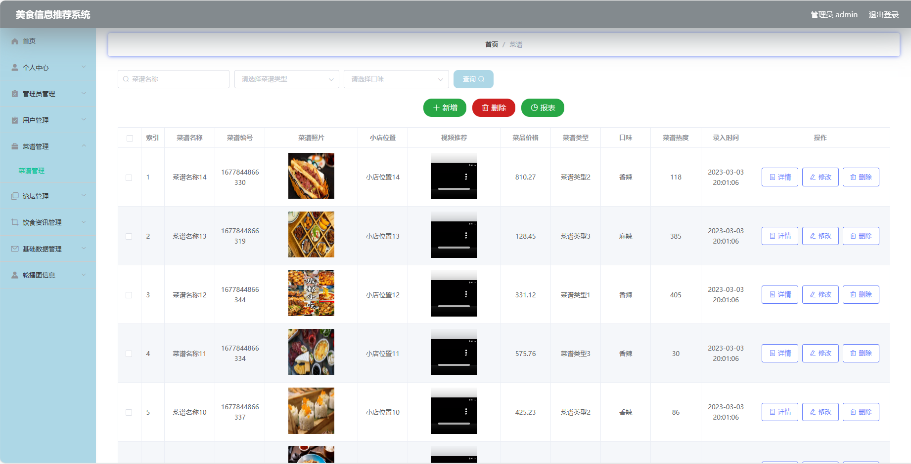

基于Springboot的美食分享平台（程序+论文）
=
### 完整代码获取地址：从戎源码网 ([https://armycodes.com/](https://armycodes.com/))
### 作者微信：19941326836  QQ：952045282 
### 承接计算机毕业设计、Java毕业设计、Python毕业设计、深度学习、机器学习
### 选题+开题报告+任务书+程序定制+安装调试+论文+答辩ppt 一条龙服务
### 所有选题地址https://github.com/nature924/allProject

一、项目介绍
---
基于Spring Boot框架实现的美食分享平台，系统包含两种角色：管理员、用户,系统分为前台和后台两大模块，主要功能如下。
### 【前台功能】

1. 首页：提供用户进入系统的入口。
2. 菜谱：用户可以浏览系统中分享的各种菜谱。
3. 论坛：用户可以在论坛上进行饮食交流、分享心得等。
4. 饮食资讯：提供最新的饮食资讯、健康饮食建议等信息。
5. 个人中心：用户可以管理个人信息。

### 【后台功能】

1. 首页：提供管理员进入后台管理的入口。
2. 个人中心：管理员可以管理个人信息。
3. 管理员管理：进行管理员权限的分配和管理。
4. 用户管理：查看、编辑、冻结或删除用户账号。
5. 菜谱管理：添加、编辑、删除系统中的菜谱信息。
6. 论坛管理：管理论坛板块。
7. 饮食资讯管理：发布、编辑、删除系统的饮食资讯和健康建议。
8. 基础数据管理：管理系统的基础数据。
9. 轮播图信息：管理员可以设置首页轮播图。

二、项目技术
---
- 编程语言：Java
- 数据库：MySQL
- 项目管理工具：Maven
- 前端技术：VUE、HTML、Jquery、Bootstrap
- 后端技术：Spring、SpringMVC、MyBatis

三、运行环境
---
- 操作系统：Windows、macOS都可以
- JDK版本：JDK1.8以上都可以
- 开发工具：IDEA、Ecplise、Myecplise都可以
- 数据库: MySQL5.7以上都可以
- Tomcat：任意版本都可以
- Maven：任意版本都可以

四、运行截图
---
### 论文截图：

### 程序截图：

